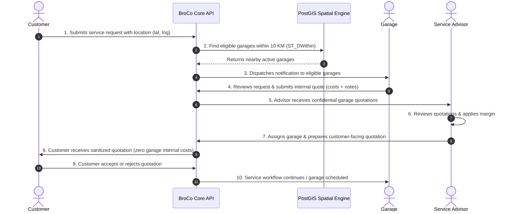

# BroCo Mod Platform

Production-grade automotive service brokerage platform built as a high-performance **modular monolith**. Connects customers with vetted local garages via dedicated advisor curation and geospatial matching.

---

## Architecture Overview

BroCo Mod orchestrates four dedicated portals over a stateless backend core:

```
┌────────────────────────────────────────────────────────────────────────┐
│                          BroCo Mod Portals                             │
├─────────────────┬─────────────────┬──────────────────┬─────────────────┤
│ Customer Portal │  Garage Portal  │  Advisor Portal  │SuperAdmin Portal│
└────────┬────────┴────────┬────────┴────────┬─────────┴────────┬────────┘
         │                 │                 │                  │
         └─────────────────┼─────────────────┴──────────────────┘
                           ▼
                  [ Reverse Proxy (Nginx) ]
                           │
             ┌─────────────┴─────────────┐
             ▼                           ▼
    [ Next.js Frontend ]        [ ASP.NET Core 8 Web API ]
                                (Clean Architecture Core)
                                         │
                         ┌───────────────┴───────────────┐
                         ▼                               ▼
             [ PostgreSQL + PostGIS ]             [ Redis 7 Cache ]
             (Spatial 10 KM Matching)           (Session & Fast State)
```

### The 4 Dedicated Portals

1. **Customer Portal:** Request submission, location pin, vehicle details, review sanitized customer proposals, approve or decline quotes.
2. **Garage Portal:** Local service request notifications within configurable radius (default 10 KM), internal cost calculation, internal quote submission.
3. **Advisor Portal:** Multi-garage quotation review, markup and margin management, customer quotation approval and assignment.
4. **Super Admin Portal:** System administration, garage onboarding, geospatial radius configuration, auditing.

---

## Core Service Flow



---

## Pricing Security & Data Isolation Mandate

> **CRITICAL REQUIREMENT:** Garage internal pricing, wholesale parts costs, and garage profit margins must **NEVER** be exposed to customers through frontend or backend APIs.

- **Data Segregation:** The database schema maintains separate entities (`GarageQuote` vs `CustomerQuotation`).
- **DTO Isolation:** Customer-facing endpoints strictly return `CustomerQuoteViewDto` which omits all internal pricing fields.
- **Policy Enforcement:** `QuoteDataIsolationPolicy` throws `DataIsolationViolationException` if any attempt is made by a Customer role to read internal pricing.

---

## Repository Structure

```
broco-mod/
├── .github/workflows/ci.yml       # GitHub Actions Continuous Integration
├── docs/                          # Comprehensive system documentation
│   ├── architecture/              # High-level architecture and portals
│   ├── database/                  # PostgreSQL + PostGIS schemas and spatial indexes
│   ├── api/                       # API contracts and DTO specifications
│   ├── decisions/                 # Architecture Decision Records (ADRs)
│   └── deployment/                # Production and deployment guidelines
├── src/
│   ├── backend/                   # ASP.NET Core Clean Architecture
│   │   ├── BroCoMod.Domain/       # Entities, Enums, Value Objects, Exceptions
│   │   ├── BroCoMod.Application/  # DTOs, Security Policies, Interfaces
│   │   ├── BroCoMod.Infrastructure/# EF Core, PostGIS Npgsql, Redis, Migrations
│   │   └── BroCoMod.Api/          # REST Controllers, Health Checks, Swagger
│   └── frontend/                  # Next.js 14 (App Router, Tailwind CSS)
├── tests/
│   ├── BroCoMod.UnitTests/        # Domain rules & pricing isolation unit tests
│   └── BroCoMod.IntegrationTests/ # WebApplicationFactory integration tests
├── docker/
│   ├── backend/Dockerfile         # Multi-stage ASP.NET Core 8 container
│   ├── frontend/Dockerfile        # Multi-stage Next.js standalone container
│   ├── nginx/                     # Reverse proxy routing config and Dockerfile
│   └── postgres/init-postgis.sql  # PostGIS extension initialization
├── infra/                         # Kubernetes manifests and Terraform scaffolds
├── docker-compose.yml             # Local multi-container development environment
├── docker-compose.override.yml.example
├── .gitignore
├── .dockerignore
├── .env.example
├── CONTRIBUTING.md
└── README.md
```

---

## Getting Started

### Prerequisites

- [Docker Desktop](https://www.docker.com/) (with Docker Compose)
- [.NET 8 SDK](https://dotnet.microsoft.com/)
- [Node.js 20+](https://nodejs.org/)

### Quickstart with Docker Compose

```bash
# 1. Clone repository
git clone <repo-url> broco-mod
cd broco-mod

# 2. Copy environment template
cp .env.example .env

# 3. Start complete environment
docker compose up -d

# 4. Verify running services
docker compose ps
```

Services will be accessible at:
- **Web App / Nginx:** [http://localhost](http://localhost)
- **Direct Frontend:** [http://localhost:3000](http://localhost:3000)
- **Backend API & Swagger:** [http://localhost:5000/swagger](http://localhost:5000/swagger)
- **Health Endpoint:** [http://localhost:5000/health](http://localhost:5000/health)

---

## Running Locally for Development

### 1. Start Database & Redis Only

```bash
docker compose up -d postgres redis
```

### 2. Run Backend

```bash
dotnet build BroCoMod.sln
dotnet run --project src/backend/BroCoMod.Api
```

### 3. Run Frontend

```bash
cd src/frontend
npm install
npm run dev
```

---

## Testing

```bash
# Run unit tests
dotnet test tests/BroCoMod.UnitTests

# Run integration tests
dotnet test tests/BroCoMod.IntegrationTests

# Run all tests
dotnet test BroCoMod.sln
```

---

## Branching Strategy

- `main`: Production releases only
- `develop`: Integration branch
- `feature/*`: Active feature development
- `release/*`: Release stabilization

Direct commits to `main` are disabled. Pull requests must pass all CI checks before merging.
