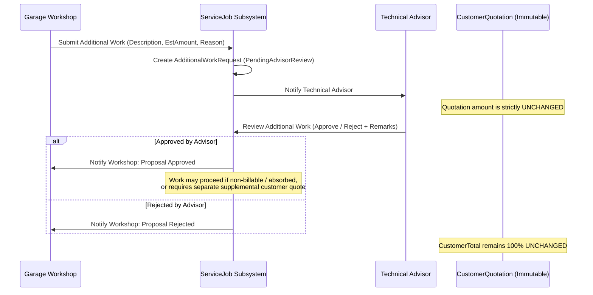

# Additional Work Proposals & Quotation Immutability

## 1. Overview & Core Commercial Invariant
During physical intake, diagnostics, or active repair execution, mechanics may identify previously undetected mechanical defects or necessary additional maintenance items.

> [!CAUTION]
> **STRICT IMMUTABILITY INVARIANT**:
> An accepted `CustomerQuotation` represents a legally binding commercial agreement between BroCo Mod and the customer. Under **no circumstances** may garage additional work requests automatically mutate an accepted quotation, alter the `CustomerTotal`, or bill the customer without explicit customer approval.

---

## 2. Additional Work Request Lifecycle

---

## 3. Workflow Specifications

1. **Submission (`POST /api/v1/garage/jobs/{id}/additional-work`)**:
   - Authorized garage staff submit:
     - `Description`: Specific repair or part required.
     - `EstimatedAdditionalAmount`: Proposed workshop cost estimate.
     - `Reason`: Technical justification discovered during service.
   - Status initialized to `PendingAdvisorReview`.
   - In-app notification sent to the Technical Advisor.

2. **Advisor Evaluation (`POST /api/v1/advisor/jobs/{id}/additional-work/{additionalWorkId}/review`)**:
   - The Technical Advisor audits the technical necessity and cost justification.
   - The Advisor approves or rejects the proposal with recorded remarks.
   - Status updated to `Approved` or `Rejected`.
   - In-app notification dispatched back to the workshop staff.

3. **Quotation Isolation Guarantee**:
   - Verified by integration test `AdditionalWorkRequest_DiscoveredDuringService_RequiresAdvisorReview_AndNeverMutatesAcceptedQuotation`.
   - The accepted `CustomerQuotation.CustomerTotal` before and after additional work proposal submission and advisor review is asserted to be identical.
