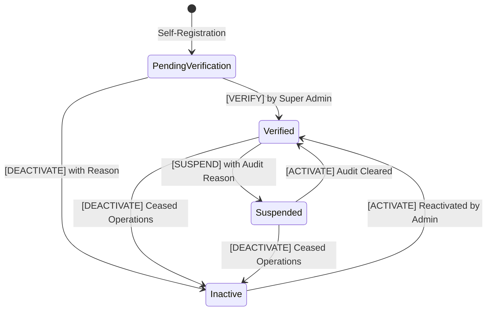

# Admin Operations & Security Governance

## 1. Role Boundaries & Authorization Model
All administrative operations require the `SUPER_ADMIN` role, enforced by ASP.NET Core `[Authorize(Roles = AppRoles.SuperAdmin)]` attributes and granular claim permissions.

### Admin Permissions
- `ADMIN_DASHBOARD_VIEW`: Real-time operational KPI aggregation
- `ADMIN_REQUESTS_VIEW`: Service request supervision and unified timeline inspection
- `ADMIN_REQUESTS_MANAGE`: Administrative reassignment and operational intervention
- `ADMIN_GARAGES_VIEW`: Partner workshop registry queries
- `ADMIN_GARAGES_MANAGE`: Workshop state transitions and service radius configuration
- `ADMIN_ADVISORS_VIEW`: Advisor directory and workload inspection
- `ADMIN_ADVISORS_MANAGE`: Advisor account activation and deactivation
- `ADMIN_CUSTOMERS_VIEW`: Customer account directory and vehicle fleet queries
- `ADMIN_JOBS_VIEW`: Workshop service job execution supervision
- `ADMIN_AUDIT_VIEW`: Security and operational audit log exploration
- `ADMIN_NOTIFICATIONS_VIEW`: Transactional notification delivery tracking
- `ADMIN_NOTIFICATIONS_MANAGE`: Controlled idempotent retry triggers
- `ADMIN_SYSTEMHEALTH_VIEW`: Infrastructure telemetry access

## 2. Workshop Onboarding & Verification State Machine

### Configurable Service Radius
- Each workshop defines a `ServiceRadiusKm` (double precision, default 10.0 KM, constrained between 1.0 KM and 50.0 KM).
- The PostGIS matching query enforces:
  `ST_DWithin(g.Location, customerLocation, MIN(searchRadius, g.ServiceRadiusKm * 1000.0))`
- Only workshops in `Status == GarageStatus.Verified` and `IsActive == true && IsOperational == true` receive proximity dispatches.

## 3. Customer Data Security & Masking
When querying customer accounts or service history:
- Identity credentials (password hashes, password salts, security stamps, tokens) are strictly excluded from all application DTOs and API responses.
- Administrative queries are logged with operator ID, IP address, and timestamp.
