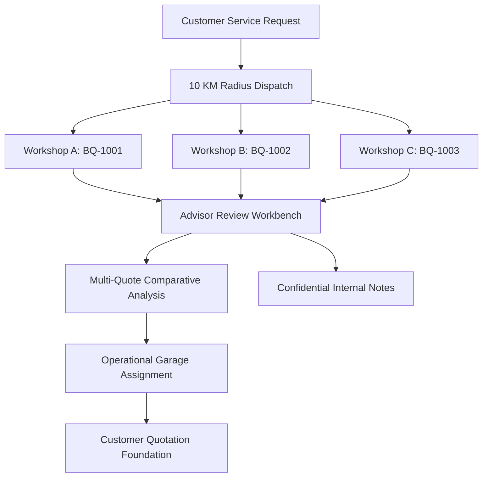

# Advisor Quotation Review & Multi-Garage Comparison

## 1. Overview
The **Advisor Quotation Review** workflow serves as the operational intelligence hub for BroCo Mod Technical Advisors. Following dispatch of a customer service request to partner workshops within a 10 KM radius, workshops submit competing bids. The technical advisor reviews, analyzes, and compares these bids on behalf of the customer before selecting an execution partner.

---

## 2. Multi-Garage Quotation Comparison
The advisor workbench provides aggregated comparative metrics across all submitted quotes for an authorized service request:

- **Pricing Totals:** Subtotal, discount, statutory tax (GST), and grand total.
- **Turnaround Feasibility:** Estimated completion hours and days.
- **Geographic Distance:** Accurate distance in kilometers between customer pickup location and partner garage calculated via PostGIS ST_Distance.
- **Scope Breakdown:** Detailed inspection of workshop line items categorized into Labour, Parts (OEM/Aftermarket), and Mandatory Services.
- **Lowest Bid Indicator:** Dynamic highlighting of the most cost-effective bid without automated selection.

> [!IMPORTANT]
> The system **does not** automatically select the cheapest garage. BroCo Mod relies on the expertise of certified Technical Advisors to weigh proximity, turnaround time, workshop reputation, parts authenticity, and fair pricing.

---

## 3. Confidential Internal Notes (`AdvisorRequestNote`)
Advisors record operational findings, diagnostic phone summaries, and pricing rationales directly on the request thread.

### Security Invariants:
1. **Confidentiality:** Internal notes are stored with `IsInternal = true` and are **never** exposed to Customers or Garages.
2. **Author Ownership:** An advisor can edit or delete their own notes; cross-advisor note modification is forbidden unless performed by a `SuperAdmin`.
3. **Auditability:** Note creation, updates, and deletions produce structured audit log events with timestamp and user attribution.

---

## 4. State Machine Transitions
When quotations are received and under active comparison:
- `ServiceRequestStatus`: `GaragesNotified` / `QuotesReceived` $\rightarrow$ `AdvisorReview` (13).
- `GarageQuoteStatus`: `Submitted` $\rightarrow$ `UnderReview` $\rightarrow$ `SelectedByAdvisor` (winning quote) or `RejectedByAdvisor`.

---

## 5. Endpoints Summary
- `GET /api/v1/advisor/requests/{id}/quotes` — Retrieve multi-quote comparison summary.
- `GET /api/v1/advisor/requests/{id}/notes` — List confidential internal notes.
- `POST /api/v1/advisor/requests/{id}/notes` — Create confidential internal note.
- `PUT /api/v1/advisor/requests/{id}/notes/{noteId}` — Update existing note (author only).
- `DELETE /api/v1/advisor/requests/{id}/notes/{noteId}` — Delete existing note (author only).
