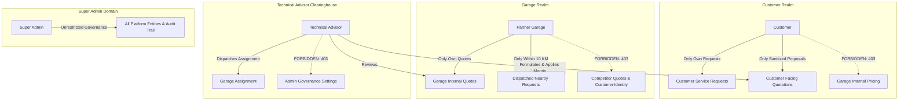

# Authorization & Data Isolation Architecture

## 1. Overview
Authorization in BroCo Mod is governed by a **two-layer model**:
1. **Coarse-grained Role Checks**: Enforces portal-level boundaries (`CUSTOMER`, `GARAGE_OWNER`, `GARAGE_MANAGER`, `GARAGE_STAFF`, `ADVISOR`, `SUPER_ADMIN`).
2. **Fine-grained Permission Checks**: Granular capabilities verified via custom authorization handler (`PermissionAuthorizationHandler`) and `[HasPermission(...)]`.
3. **Data Isolation Guards**: Strict entity-level boundaries preventing cross-tenant or horizontal privilege escalation.

---

## 2. Platform Permission Hierarchy

The system defines 24 strongly typed platform permissions:

### Customer Permissions
- `CUSTOMER_REQUEST_CREATE` — Submit service or modification requests.
- `CUSTOMER_REQUEST_VIEW` — View customer's own service requests.
- `CUSTOMER_QUOTE_VIEW` — Inspect approved customer quotations.
- `CUSTOMER_QUOTE_RESPOND` — Accept or decline proposals.
- `CUSTOMER_PROFILE_MANAGE` — Update profile and vehicle inventory.

### Garage Permissions
- `GARAGE_REQUEST_VIEW` — View dispatched requests within 10 KM.
- `GARAGE_REQUEST_ACCEPT` — Accept and commit to quote on request.
- `GARAGE_REQUEST_DECLINE` — Pass on dispatched request.
- `GARAGE_QUOTE_CREATE` — Submit internal workshop quotation.
- `GARAGE_QUOTE_UPDATE` — Revise submitted workshop quote.
- `GARAGE_PROFILE_MANAGE` — Manage workshop profile and operating hours.
- `GARAGE_USERS_MANAGE` — Manage staff accounts within workshop.

### Technical Advisor Permissions
- `ADVISOR_REQUEST_VIEW` — Review incoming dispatched requests.
- `ADVISOR_QUOTE_VIEW` — View workshop internal cost bids.
- `ADVISOR_QUOTE_REVIEW` — Assess technical compliance and part viability.
- `ADVISOR_CUSTOMER_QUOTE_CREATE` — Apply broker margins and publish customer quotation.
- `ADVISOR_GARAGE_ASSIGN` — Assign confirmed repair contract to workshop.
- `ADVISOR_REQUEST_REASSIGN` — Reassign job if garage capacity changes.
- `ADVISOR_PROFILE_MANAGE` — Update advisor credentials and specialization.

### Super Admin Permissions
- `ADMIN_USERS_MANAGE` — Platform-wide user governance and activation/suspension.
- `ADMIN_GARAGES_MANAGE` — Approve, onboard, and audit partner workshops.
- `ADMIN_ADVISORS_MANAGE` — Oversee technical advisor assignments.
- `ADMIN_REQUESTS_MANAGE` — Global oversight over all platform dispatches.
- `ADMIN_SETTINGS_MANAGE` — Manage radial dispatch distance and security rules.
- `ADMIN_AUDIT_VIEW` — Access the security audit trail.

---

## 3. Data Isolation Guarantees

### 3.1 Strict Isolation Rules
1. **Customer Isolation**:
   - Customers may query only records where `CustomerId == currentUser.CustomerId`.
   - Any query against another customer's ID returns `403 Forbidden` (`DataIsolationViolationException`).
   - Customer responses **never** include `garageInternalPrice`, `internalCostBreakdown`, or `advisorMarginApplied`.
2. **Garage Isolation**:
   - Garages query only records where `GarageId == currentUser.GarageId`.
   - Accessing another garage's profile or quotes returns `403 Forbidden`.
   - Garages never receive customer contact details prior to contract confirmation.
3. **Advisor Isolation**:
   - Advisors review requests and synthesize proposals.
   - Advisors are restricted from accessing `/api/v1/admin/*` system governance endpoints (403 Forbidden).
