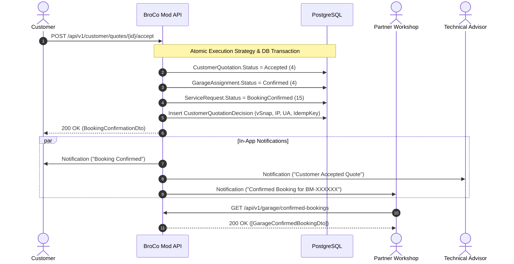

# Booking Confirmation & Partner Workshop Notification

## 1. Overview
Upon successful customer acceptance of a quotation proposal, the platform transitions the service booking from the evaluation phase into the confirmed operational phase.



---

## 2. Confirmed Booking Data Model & Isolation

### 2.1. Customer Confirmation Projection (`BookingConfirmationDto`)
The customer receives immediate confirmation containing:
- `QuotationId` & `QuotationNumber` (`CQ-XXXXXX`)
- `ServiceRequestId` & `RequestNumber` (`BM-XXXXXX`)
- `GarageId`, `GarageName`, `GarageAddress`, `GaragePhone`
- `ConfirmedTotal` & `Currency` (`INR`)
- `ConfirmedAtUtc`
- `Status` (`BookingConfirmed`)
- `VehicleSummary`
- Guarantee confirmation message

### 2.2. Garage Confirmed Bookings View (`GarageConfirmedBookingDto`)
The partner garage accesses only their own confirmed bookings via `GET /api/v1/garage/confirmed-bookings`:
- `AssignmentId`
- `ServiceRequestId` & `RequestNumber` (`BM-XXXXXX`)
- `VehicleMake`, `VehicleModel`, `VehicleYear`, `VehicleLicensePlate`
- `ProblemDescription`
- `ConfirmedAtUtc`
- `QuotedAmount` & `QuoteNumber` (`BQ-XXXXXX`)

> [!IMPORTANT]
> **Data Isolation Invariant:**
> Garages only see their own agreed wholesale `QuotedAmount` (`GarageQuote.TotalAmount`). They do not see the customer retail price, other garage bids, or platform margins.

---

## 3. Workshop Assignment Invariant & Constraints
The database guarantees at most one active or confirmed garage assignment per service request through the partial unique index:
```sql
CREATE UNIQUE INDEX "IX_GarageAssignments_ServiceRequestId"
ON "GarageAssignments" ("ServiceRequestId")
WHERE "Status" IN (1, 4); -- 1 = Assigned, 4 = Confirmed
```
This guarantees that once a garage is assigned or confirmed, no duplicate assignment can be created concurrently without explicit prior cancellation.
