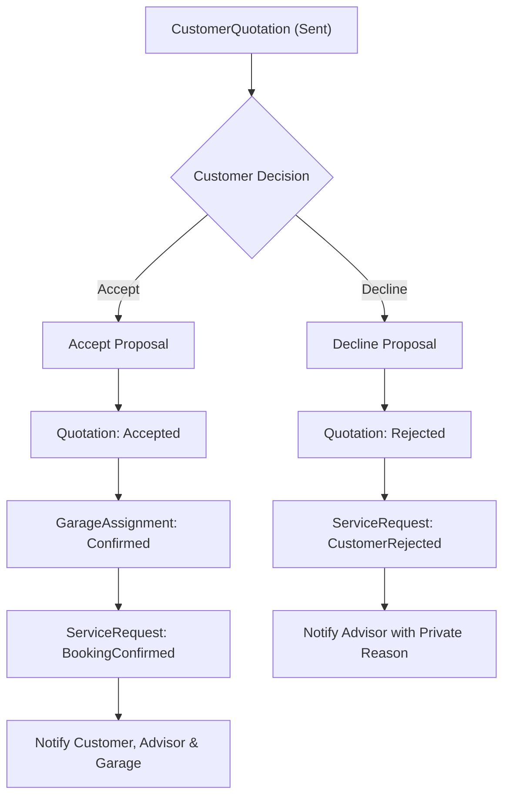

# Customer Quotation Decision Workflow

## 1. Overview
The **Customer Decision Workflow** is the critical commercial junction where the vehicle owner reviews the curated, verified `CustomerQuotation` and makes an authoritative decision: **Accept** or **Decline**.

---

## 2. Decision State Machine & Invariants

### 2.1. Accept Flow
1. **Pre-condition Validation:**
   - Quotation must exist and belong to authenticated customer.
   - Status must be strictly `CustomerQuotationStatus.Sent`.
   - Quotation must NOT be expired (`ValidUntilUtc > DateTime.UtcNow`).
   - Active partner garage assignment must exist in `Assigned` status (`GarageAssignmentStatus.Assigned`).
   - Immutable version snapshot must be present.
2. **Atomic Execution (Wrapped in Execution Strategy & DB Transaction):**
   - Customer quotation status transitions to `Accepted` (`CustomerQuotationStatus.Accepted`).
   - `AcceptedAtUtc` and `CustomerRespondedAtUtc` set to current UTC.
   - `AcceptedVersionId` permanently bound to the active snapshot.
   - `GarageAssignment` transitions from `Assigned (1)` to `Confirmed (4)`.
   - `ServiceRequest` transitions to `BookingConfirmed (15)`.
   - `CustomerQuotationDecision` entity recorded with `CustomerDecisionType.Accepted`, optional remarks, client IP, user agent, and idempotency key.
   - `ConcurrencyToken` updated on both quotation and assignment.
3. **Post-Commit Notifications & Audit:**
   - In-app notification sent to Customer ("Booking Confirmed").
   - In-app notification sent to Advisor ("Customer Accepted Quote").
   - In-app notification sent to Workshop Staff ("New Confirmed Booking").
   - Audit trail records: `CUSTOMER_QUOTATION_ACCEPTED`, `GARAGE_ASSIGNMENT_CONFIRMED`, `BOOKING_CONFIRMED`.

### 2.2. Decline / Reject Flow
1. **Pre-condition Validation:**
   - Quotation must exist and belong to authenticated customer.
   - Status must be strictly `CustomerQuotationStatus.Sent`.
   - Non-empty rejection `Reason` is **MANDATORY**.
   - Optional `Category` (e.g., `PRICE_TOO_HIGH`, `TIMING_NOT_SUITABLE`, `SERVICE_NOT_REQUIRED`, `CHANGED_MIND`, `OTHER`).
2. **Atomic Execution:**
   - Customer quotation status transitions to `Rejected` (`CustomerQuotationStatus.Rejected`).
   - `RejectedAtUtc` and `CustomerRespondedAtUtc` recorded.
   - `ServiceRequest` transitions to `CustomerRejected (9)`.
   - `CustomerQuotationDecision` entity created with `CustomerDecisionType.Rejected`.
3. **Customer Privacy Protection (MANDATORY INVARIANT):**
   - The customer's private reason and category are dispatched **strictly** to the assigned Advisor and recorded in the audit trail.
   - **The Partner Garage is NEVER informed of the customer's private rejection reason.**
4. **Post-Commit Notifications & Audit:**
   - In-app notification sent to Advisor ("Quotation Declined by Customer" with category and customer reason).
   - In-app notification sent to Customer ("Quotation Declined").
   - Audit trail records: `CUSTOMER_QUOTATION_REJECTED`, `SERVICE_REQUEST_REJECTED`.

---

## 3. Idempotency & Optimistic Concurrency Control

### 3.1. Idempotency Key Handling
- Decision endpoints support the standard `Idempotency-Key` HTTP header (or request body property).
- If a duplicate acceptance request is sent with an identical key:
  - System verifies previous decision under that key.
  - If already accepted, returns the existing `BookingConfirmationDto` with `HTTP 200 OK`.
  - Does NOT create duplicate database rows or duplicate notifications.

### 3.2. Concurrency Conflict Protection
- If a customer double-submits or operates from multiple browser tabs:
  - If a decision was already recorded or quotation status is no longer `Sent`, the server returns `HTTP 409 Conflict`.
  - Database row modifications utilize EF Core concurrency token checks (`ConcurrencyToken`).

---

## 4. Non-Repudiation Version Binding
The `CustomerQuotationDecision` table binds to the exact `CustomerQuotationVersionId` and `VersionNumber` that the customer viewed and accepted. Even if future system revisions occur, the legally binding contract snapshot remains immutable and verifiable.
