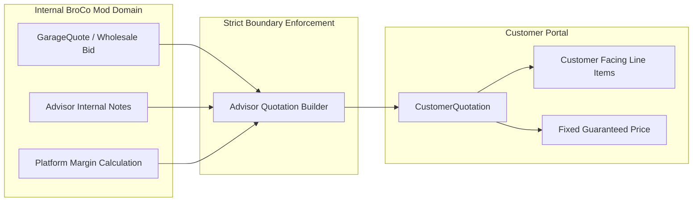
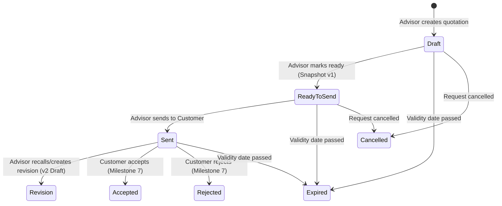

# Customer Quotation Foundation & Visibility Security

## 1. Overview
The **Customer Quotation** represents the final, curated commercial agreement presented to the vehicle owner. It is strictly segregated from internal workshop bids and cost breakdowns.

---

## 2. Customer Visibility Policy (MANDATORY INVARIANT)

> [!CAUTION]
> **Strict Pricing Confidentiality Rules:**
> 1. Customers must **NEVER** see:
>    - `GarageQuote` wholesale rates or internal labor costs.
>    - Winning or losing workshop margin markups.
>    - Unselected competitor bids.
>    - `AdvisorRequestNote` internal records.
> 2. Customers can **ONLY** view quotations in `Sent` status. Quotations in `Draft` or `ReadyToSend` status return HTTP 403 / 404 to customer accounts.
> 3. Customers can **ONLY** access quotations linked to their own verified `CustomerId`.

---

## 3. Human-Readable Sequence Identifiers
Customer quotations are identified by human-readable reference numbers formatted as `CQ-XXXXXX`:
- Generated atomically via PostgreSQL sequence `CustomerQuotationNumberSeq` starting at `100001`.
- **Gapless Disclaimer:** Sequence values are unique and atomic under normal sequence semantics, but sequence values are not guaranteed to be gapless due to rollbacks, caching, or database restarts. Security relies on authorization and ownership filters, never reference obscurity.

---

## 4. Immutable Version Snapshots (`CustomerQuotationVersion`)
To ensure complete non-repudiation and prevent historical tampering:
- Whenever a quotation is marked `ReadyToSend` or revised, a `CustomerQuotationVersion` snapshot is created.
- The snapshot records:
  - Version number
  - Financial figures (`CustomerSubtotal`, `CustomerDiscount`, `CustomerTax`, `CustomerTotal`)
  - Scope summary and remarks
  - Serialized JSON of all line items as approved at that moment
  - Created by user ID and timestamp

---

## 5. Lifecycle State Transitions

---

## 6. Endpoints Summary
- `POST /api/v1/advisor/requests/{id}/customer-quotation` — Create customer quotation draft.
- `GET /api/v1/advisor/customer-quotations/{id}` — Retrieve full quotation with lineage.
- `PUT /api/v1/advisor/customer-quotations/{id}/draft` — Update customer quotation draft.
- `POST /api/v1/advisor/customer-quotations/{id}/ready` — Mark ready to send (creates snapshot).
- `POST /api/v1/advisor/customer-quotations/{id}/send` — Send quotation to customer.
- `GET /api/v1/customer/quotes` — Customer views list of approved sent quotations.
- `GET /api/v1/customer/quotes/{id}` — Customer views sanitized quotation details.
- `GET /api/v1/admin/customer-quotations` — Platform-wide customer proposals audit.
