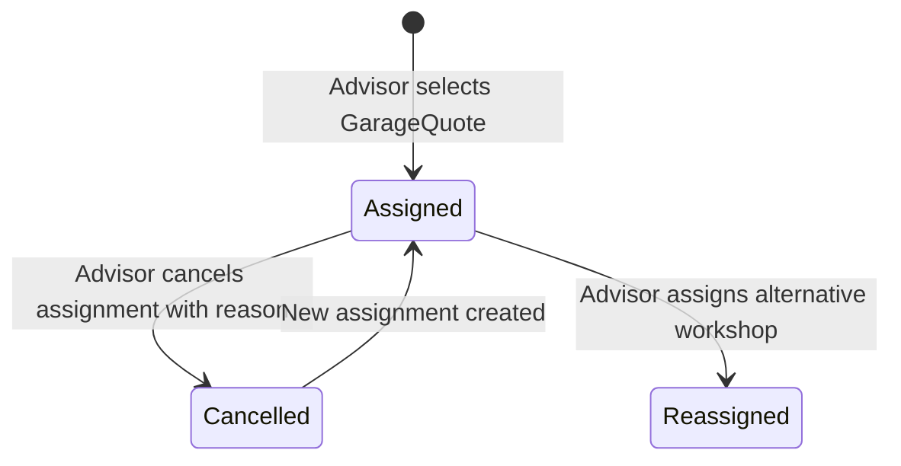

# Garage Selection & Assignment

## 1. Overview
The **Garage Assignment** architecture formally binds a customer's `ServiceRequest` to a selected partner workshop and their winning `GarageQuote`. It establishes commercial accountability, triggers fulfillment preparation, and unlocks the Customer Quotation Builder.



---

## 2. Business Rules & Validation Invariants

1. **Active & Verified Workshop:** A garage can only be assigned if their account is `IsActive = true` and `IsVerified = true`.
2. **Dispatched Mandate:** The garage must have been officially dispatched a `GarageRequest` within the configured geographic search radius.
3. **Submitted Quotation:** The selected quote must be in `Submitted` or `UnderReview` status and have a non-expired `ValidUntil` date.
4. **Single Active Assignment Invariant:**
   - A `ServiceRequest` can have **at most one** active assignment (`Status = Assigned`) at any time.
   - Enforced at both application and database level via PostgreSQL partial unique index:
     ```sql
     CREATE UNIQUE INDEX "IX_GarageAssignments_ServiceRequestId"
     ON "GarageAssignments" ("ServiceRequestId")
     WHERE "Status" = 1;
     ```
5. **Reassignment Protocol:**
   - Attempting to assign a second workshop while an active assignment exists requires explicitly cancelling or reassigning the existing assignment.
   - Assignment cancellation requires an operational reason recorded for compliance and partner dispute resolution.
6. **Optimistic Concurrency:**
   - Each `GarageAssignment` carries a `ConcurrencyToken` (UUID). Conflicting concurrent assignment requests return HTTP 409 Conflict.

---

## 3. Data Model

| Field | Type | Description |
|---|---|---|
| `Id` | UUID | Primary Key |
| `ServiceRequestId` | UUID | Reference to parent service request |
| `GarageId` | UUID | Partner workshop assigned |
| `SelectedQuoteId` | UUID | Winning GarageQuote reference |
| `AssignedByAdvisorId` | UUID | User ID of the technical advisor |
| `AssignedAtUtc` | Timestamp | UTC timestamp of assignment |
| `Status` | Integer / Enum | 1: Assigned, 2: Cancelled, 3: Reassigned |
| `AssignmentReason` | String | Advisor justification |
| `CancelledAtUtc` | Timestamp? | Cancellation timestamp if cancelled |
| `CancellationReason` | String? | Reason for cancellation |
| `ConcurrencyToken` | UUID | Optimistic lock token |

---

## 4. Endpoints Summary
- `POST /api/v1/advisor/requests/{id}/assignment` — Create or reassign garage assignment.
- `GET /api/v1/advisor/requests/{id}/assignment` — Retrieve active assignment for request.
- `GET /api/v1/admin/assignments` — Platform-wide audit of all workshop assignments.
