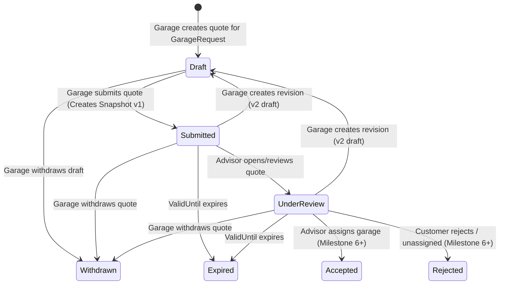

# Garage Quotation Workflow (Milestone 5)

## 1. Overview & Architecture

The Garage Quotation Workflow enables partner workshops to review incoming service dispatch requests (`GarageRequest`), formulate comprehensive itemized commercial quotes (`GarageQuote`), submit them to BroCo Mod advisors, revise quotes while preserving immutable version history (`GarageQuoteVersion`), and withdraw quotes when necessary.

---

## 2. Quotation State Machine

The quotation state machine is governed by `QuoteStatus`:

| State | Description | Permitted Actions |
| :--- | :--- | :--- |
| **Draft** (`1`) | Quote is being authored or revised by the workshop. Hidden from advisors. | Update draft, Submit, Withdraw |
| **Submitted** (`2`) | Quote submitted by workshop. Version snapshot created. Advisor notified. | Create Revision, Withdraw, Advisor Inspect |
| **UnderReview** (`3`) | Quote viewed and analyzed by an Advisor. | Create Revision, Withdraw, Advisor Inspect |
| **Accepted** (`4`) | Selected by Advisor for customer fulfillment (Milestone 6+). | View-only |
| **Rejected** (`5`) | Not selected or superseded by alternative offer. | View-only |
| **Withdrawn** (`6`) | Cancelled by workshop before final acceptance. | View-only |
| **Expired** (`7`) | `ValidUntil` timestamp reached without acceptance. Automatically transitioned by background service. | View-only |

---

## 3. Server-Authoritative Financial Calculations

Client applications provide line items with unit prices, quantities, and optional discounts. To guarantee financial integrity and prevent tampering, **all line item totals, quote subtotal, tax amounts, and grand total are strictly calculated and enforced on the server**.

### Line Item Calculation
$$\text{LineTotal} = (\text{Quantity} \times \text{UnitPrice}) - \text{DiscountAmount}$$
- Minimum `LineTotal` is clamped at $0.00$.

### Quote Calculation Summary
1. **Subtotal**: Sum of all line item totals:
   $$\text{Subtotal} = \sum \text{LineTotal}_i$$
2. **Discount**: Commercial discount applied to the quote:
   $$\text{TotalDiscount} = \text{QuoteDiscount}$$
3. **Taxable Amount**:
   $$\text{TaxableAmount} = \max(0, \text{Subtotal} - \text{Discount})$$
4. **GST / Tax**:
   $$\text{TaxAmount} = \text{TaxableAmount} \times \frac{\text{TaxRate}}{100}$$
5. **Grand Total**:
   $$\text{GrandTotal} = \text{TaxableAmount} + \text{TaxAmount}$$

---

## 4. Immutable Version Snapshots & Revisions

1. **Submission Snapshotting**: When a quote is first submitted, an immutable `GarageQuoteVersion` record (`Version = 1`) is created containing the complete financial summary and a serialized JSON snapshot of all line items.
2. **Revisions (`v{n+1}`)**: A workshop may revise an existing submitted quote. When initiating a revision:
   - The quote status is transitioned to `Draft`.
   - The current version number increments ($n \to n+1$).
   - Existing line items can be modified, removed, or added.
   - Upon resubmission, a new immutable snapshot record is stored with `Version = n+1`.
   - Full audit history of past versions remains queryable by advisors and platform administrators.

---

## 5. Non-Gapless Sequence Identifiers

Garage quotes are assigned human-readable reference identifiers in the format `BQ-XXXXXX` (e.g., `BQ-100001`):

- **Generation Strategy**: Generated atomically via PostgreSQL sequence `GarageQuoteNumberSeq`.
- **Gapless Disclaimer**: The `BQ-XXXXXX` identifier is a unique human-readable reference. **Sequence values are not guaranteed to be gapless** due to database transactions, rollbacks, caching, or server restarts under normal PostgreSQL sequence semantics.
- **Security Boundary**: The `BQ-XXXXXX` reference provides identifier readability only. Security against enumeration relies strictly on:
  - JWT Authentication
  - Role-based and Permission-based Authorization (`AppPermissions.GarageQuoteRead`, etc.)
  - Explicit multi-tenant ownership checks (`Quote.GarageId == CurrentUser.GarageId`)
  - Strict resource-level data isolation

---

## 6. Strict Pricing & Role Isolation

| Role | Access Permissions | Scope & Boundaries |
| :--- | :--- | :--- |
| **GARAGE_OWNER / STAFF** | `GARAGE_QUOTE_CREATE`, `GARAGE_QUOTE_UPDATE`, `GARAGE_QUOTE_SUBMIT`, `GARAGE_QUOTE_WITHDRAW`, `GARAGE_QUOTE_READ` | Can only view and manage quotes belonging to their own garage (`GarageId`). |
| **ADVISOR** | `GARAGE_QUOTE_READ` | Can view all partner garage quotes submitted for service requests. **CANNOT** assign garages, apply customer margins, or create customer quotations in Milestone 5. |
| **SUPER_ADMIN** | `GARAGE_QUOTE_READ` | Full auditing and read access across all partner quotations and revisions. |
| **CUSTOMER** | *None* | **Zero access**. Customer endpoints and DTOs never expose garage quotes, partner line items, or wholesale rates. Any attempt by a customer to query garage quotes yields HTTP 403 Forbidden. |

---

## 7. Background Expiration Service

`QuoteExpirationBackgroundService` runs as an `IHostedService` on a 15-minute interval:
- Queries all quotes in `Submitted` or `UnderReview` state where `ValidUntil < DateTime.UtcNow`.
- Atomically transitions them to `QuoteStatus.Expired`.
- Emits in-app notifications and audit logs for expired quotes.
