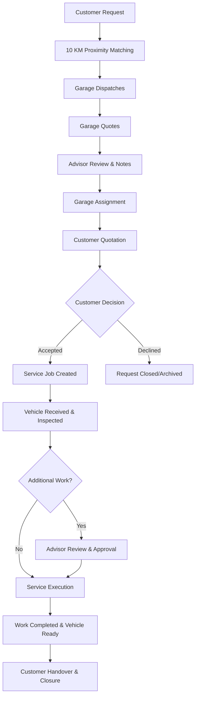
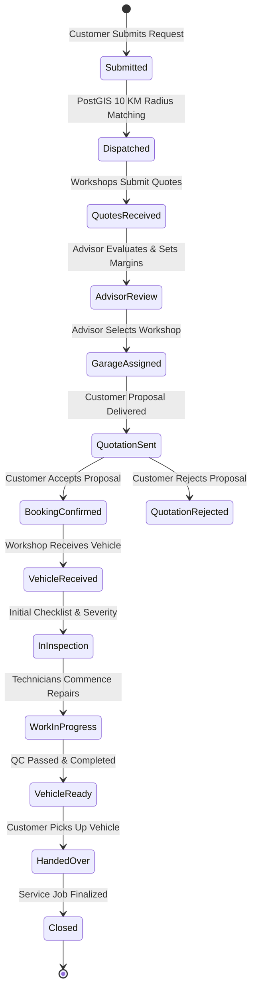

# Operations Control Center Architecture

## 1. Overview
The **Operations Control Center** delivers end-to-end platform management, governance, and operational oversight for Super Admins and Technical Advisors in the BroCo Mod ecosystem. It provides unified real-time visibility across the entire request-to-service lifecycle while preserving strict role and data isolation boundaries.

## 2. Core Operational Pillars
1. **Live Platform KPIs**: Direct SQL aggregation for service requests, workshop network health, advisor allocations, active service jobs, and delivery health.
2. **Unified Operational Timeline**: A single operational pane per request linking all stages: Customer Request, Spatial Dispatches, Garage Quotes, Advisor Margin Review, Garage Assignment, Customer Quotation, Decision Event, Service Job, Inspection, and Completion Audit.
3. **Workshop Network Governance**: Comprehensive state machine governing garage onboarding (`PendingVerification`, `Verified`, `Suspended`, `Inactive`), service radius configuration (1.0 to 50.0 KM), and performance win rates.
4. **Technical Advisor Duty Management**: Work queue orchestration with specialized stages: Quote Reviews, Ready-to-Send Proposals, Customer Decisions, and Additional Work authorizations.
5. **Operational Attention Queue**: Query-driven alerting engine surfacing expiring quotations, stale garage dispatches, pending advisor reviews, and failed notifications without manual polling.

## 3. End-to-End Operational Lifecycle

