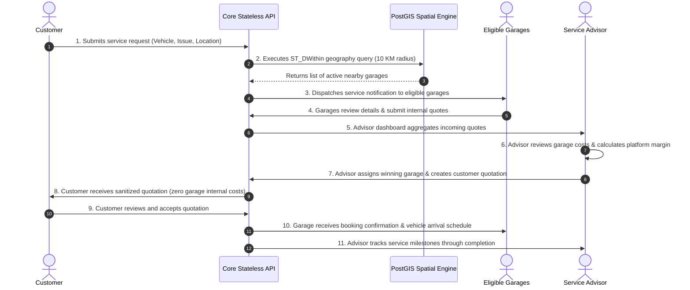

# BroCo Mod Architecture Overview

## 1. System Vision & Modularity

BroCo Mod is engineered as an enterprise-grade **Modular Monolith** designed for high availability, transactional integrity, and rapid iteration. The system operates as a **stateless API core**, allowing seamless horizontal scaling behind a reverse proxy/load balancer while eliminating the operational complexity and network latency of premature microservices.

```
                      +-----------------------------+
                      |         Web Portals         |
                      | (Customer, Garage, Advisor, |
                      |         SuperAdmin)         |
                      +--------------+--------------+
                                     |
                                     v
                      +-----------------------------+
                      |     Nginx Reverse Proxy     |
                      +--------------+--------------+
                                     |
                      +--------------v--------------+
                      |   Next.js Frontend (SSR)    |
                      +--------------+--------------+
                                     | (REST / JSON)
                                     v
                      +-----------------------------+
                      |  ASP.NET Core Web API Core  |
                      |   (Clean Arch / Stateless)  |
                      +-------+--------------+------+
                              |              |
              (Spatial / Relational)     (Cache / State)
                              |              |
                              v              v
                      +---------------+ +-----------+
                      |  PostgreSQL   | |  Redis 7  |
                      |   + PostGIS   | |  Cluster  |
                      +---------------+ +-----------+
```

---

## 2. The Four Portals

The application serves four primary actors through strictly demarcated portal surfaces:

### 2.1. Customer Portal
- **Target Audience:** Vehicle owners seeking transparent, vetted maintenance and repair.
- **Key Capabilities:**
  - Submit service requests with vehicle specifications (make, model, year) and fault descriptions.
  - Pin GPS coordinates or enter address for geospatial garage matching.
  - View sanitized, advisor-approved quotations.
  - Accept or decline quotations.
  - Track real-time service progress.
- **Data Boundary:** Strictly restricted to customer-facing pricing and high-level scope summaries. Zero visibility into garage cost structures.

### 2.2. Garage Portal
- **Target Audience:** Independent repair shops, service centers, and specialized technicians.
- **Key Capabilities:**
  - Receive automated notifications for service requests within their service radius (default 10 KM).
  - Review technical job requirements, vehicle specifications, and diagnostic codes.
  - Submit itemized internal quotations (labor hours, parts wholesale cost, technician rate).
  - Schedule work orders and update repair milestones upon customer acceptance.
- **Data Boundary:** Can only view their own submitted quotes and job assignments. Inaccessible to competitor garages' internal data.

### 2.3. Advisor Portal
- **Target Audience:** BroCo Mod certified automotive service advisors.
- **Key Capabilities:**
  - Aggregate and evaluate quotes from all responding garages for a customer request.
  - Review garage internal pricing, itemized parts, and estimated completion times.
  - Calculate platform margins, customer pricing tiers, and warranty inclusions.
  - Assign the winning garage and generate the formal customer-facing quotation.
  - Mediate communication between customer and workshop.
- **Data Boundary:** Full internal visibility into both garage costs and customer pricing.

### 2.4. Super Admin Portal
- **Target Audience:** Platform operations, compliance officers, and executive administrators.
- **Key Capabilities:**
  - Garage onboarding, credential verification, and insurance compliance auditing.
  - Geospatial radius configuration (e.g., dynamic radius expansion in rural zones).
  - Global financial reporting, margin analytics, and dispute resolution.
  - System health monitoring and audit logging.

---

## 3. End-to-End Core Workflow

The end-to-end lifecycle follows an 11-step orchestration loop:



---

## 4. Pricing Security & Data Isolation Architecture

### 4.1. Core Mandate
> **PRICING SECURITY RULE:** Garage internal pricing, wholesale parts costs, and garage margins must **NEVER** be exposed to customers through frontend or backend APIs.

### 4.2. Multi-Layer Defense Matrix

| Layer | Defense Mechanism | Implementation Detail |
| :--- | :--- | :--- |
| **Domain Layer** | Entity Separation | `GarageQuote` (internal) and `CustomerQuotation` (customer-facing) are distinct aggregate entities. |
| **Application Layer** | Strict DTO Projections | Customer queries strictly project to `CustomerQuoteViewDto`. No internal fields exist on this contract. |
| **Policy Enforcement** | Role-Based Guardrails | `QuoteDataIsolationPolicy.AssertCanViewInternalPricing(role)` throws `DataIsolationViolationException` if a Customer role requests internal pricing. |
| **API Boundary** | Controller Segregation | Endpoints targeting customers have no access paths to internal quote repositories. |

---

## 5. Storage & Infrastructure Strategy

- **Database:** PostgreSQL 16 with the **PostGIS 3.4** extension.
  - Spatial columns use `geography(Point, 4326)` for geodesic accuracy on the WGS84 spheroid.
  - Spatial indexes (`GIST`) accelerate radius queries (`ST_DWithin`) with sub-millisecond execution.
- **Cache & Fast State:** Redis 7.
  - Caches garage geographical bounding boxes, active session states, and idempotency tokens.
- **Scaling Roadmap:**
  - The API is 100% stateless (JWT authentication, no in-memory session affinities).
  - Can horizontally scale out API container replicas across Kubernetes pods without architecture refactoring.
