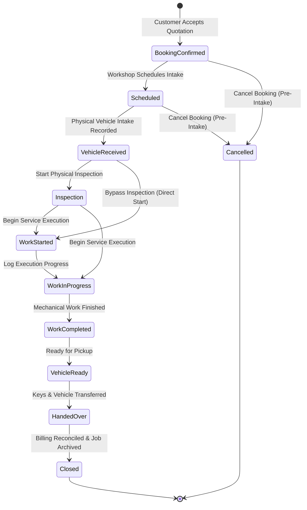

# Service Job Lifecycle State Machine

## 1. Overview
The `ServiceJob` entity models the physical and mechanical execution of automotive maintenance, tuning, and repair services following the acceptance of a customer quotation.

---

## 2. State Machine Definitions

| Status | Code | Description | Transitions Allowed | Cancellation Allowed? |
|---|---|---|---|:---:|
| `BookingConfirmed` | 1 | Instantiated automatically and idempotently upon customer quotation acceptance. | `Scheduled`, `Cancelled` | **Yes** |
| `Scheduled` | 2 | Intake date/time and estimated completion scheduled by the workshop. | `VehicleReceived`, `Cancelled` | **Yes** |
| `VehicleReceived` | 3 | Physical vehicle intake logged at the workshop; intake odometer mileage captured. | `Inspection`, `WorkStarted` | **NO (Locked)** |
| `Inspection` | 4 | Physical condition and diagnostic inspection underway. | `WorkStarted`, `WorkInProgress` | **NO** |
| `WorkStarted` | 5 | Mechanics actively working on the vehicle. | `WorkInProgress`, `WorkCompleted` | **NO** |
| `WorkInProgress` | 6 | Service execution underway; progress logs posted. | `WorkCompleted` | **NO** |
| `WorkCompleted` | 7 | All mechanical repairs, servicing, and testing completed. | `VehicleReady` | **NO** |
| `VehicleReady` | 8 | Vehicle detailed, inspected, and ready for customer pickup. | `HandedOver` | **NO** |
| `HandedOver` | 9 | Vehicle handed back to customer with keys transferred. | `Closed` | **NO** |
| `Closed` | 10 | Final execution accounting reconciled and job archived. | Terminal State | **NO** |
| `Cancelled` | 99 | Service booking cancelled prior to intake with recorded audit reason. | Terminal State | Pre-Intake Only |

---

## 3. Strict Lifecycle Invariants

1. **Intake Lock Against Cancellation**:
   Once a vehicle is physically received at a workshop (`VehicleReceived`), cancellation is **strictly forbidden**. The state machine throws an `InvalidOperationException` if cancellation is attempted on or after `VehicleReceived`.

2. **Sequential Progression**:
   Transitions must proceed linearly. Jumping states (e.g., from `BookingConfirmed` directly to `WorkCompleted` or `Closed`) is prevented by domain validation.

3. **Concurrency Control**:
   Every state modification verifies an optimistic concurrency token (`xmin` / row version) to prevent conflicting concurrent updates by workshop staff, advisors, or customers.

4. **Audited Stage Timestamps**:
   Each major lifecycle event records an immutable UTC timestamp (`ActualVehicleReceivedAtUtc`, `ActualWorkStartedAtUtc`, `ActualWorkCompletedAtUtc`, `VehicleReadyAtUtc`, `HandedOverAtUtc`, `ClosedAtUtc`).
