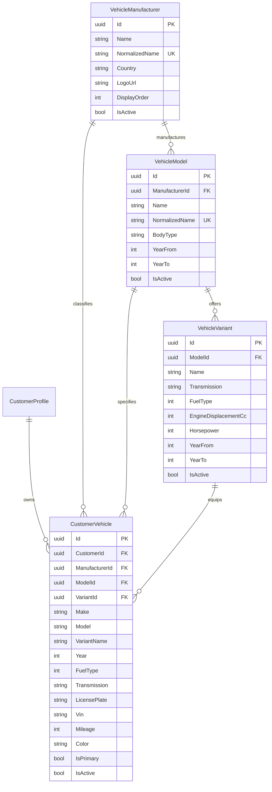

# Vehicle Master & Customer Vehicle Management Architecture

## 1. Overview
The **Vehicle Master & Customer Vehicle Management** subsystem provides a standardized, strongly typed relational OEM catalog combined with an isolated multi-tenant customer garage inventory.

---

## 2. Relational Hierarchy & Server-Side Integrity

Client-submitted identifiers (`ManufacturerId`, `ModelId`, `VariantId`) are **never trusted implicitly**. The backend service layer (`CustomerVehicleService`) strictly enforces the following validation checks prior to persisting any vehicle:

1. **Manufacturer Validation**:
   - `ManufacturerId` must exist and be active (`IsActive = true`).
2. **Model Hierarchy Validation**:
   - `ModelId` must exist and be active.
   - `Model.ManufacturerId` must equal `request.ManufacturerId`. A mismatch triggers `InvalidOperationException` with HTTP 400 Bad Request.
3. **Variant Hierarchy Validation**:
   - If `VariantId` is supplied, it must exist and be active.
   - `Variant.ModelId` must equal `request.ModelId`. A mismatch triggers `InvalidOperationException` with HTTP 400 Bad Request.
4. **Model Year Boundaries**:
   - `Year` must fall within `[Model.YearFrom, Model.YearTo ?? (CurrentYear + 1)]`. An out-of-range year triggers `ArgumentOutOfRangeException` with HTTP 400 Bad Request.

---

## 3. Customer Data Isolation Guarantees

- **No Cross-Customer Visibility**: Every customer vehicle query (`GET`, `PUT`, `DELETE`, `set-primary`) is scoped strictly by `vehicle.CustomerId == authenticatedCustomerId`.
- **Enumeration Protection**: If Customer A attempts to view, edit, or delete Customer B's vehicle ID, the system returns **HTTP 404 Not Found** (preventing ID enumeration or metadata leakage).
- **Default / Primary Vehicle Management**:
   - When a customer adds their first vehicle, it is automatically marked as primary (`IsPrimary = true`).
   - If a customer explicitly marks a vehicle as primary (via creation, update, or `/set-primary`), all other active vehicles for that customer are demoted (`IsPrimary = false`).
   - If a primary vehicle is deleted, the system automatically promotes another active vehicle to primary.

---

## 4. API Endpoints

### 4.1 Vehicle Master Catalog (Read / Query)

| Endpoint | Method | Auth | Description |
|---|---|---|---|
| `/api/v1/vehicle-manufacturers` | `GET` | Public / Auth | List all active manufacturers, order by `DisplayOrder`. Supports `?search=...`. |
| `/api/v1/vehicle-manufacturers/{id}` | `GET` | Public / Auth | Fetch manufacturer details. |
| `/api/v1/vehicle-manufacturers/{id}/models` | `GET` | Public / Auth | List cascading models for a manufacturer. Supports `?bodyType=...`. |
| `/api/v1/vehicle-models/{id}` | `GET` | Public / Auth | Fetch model details. |
| `/api/v1/vehicle-models/{id}/variants` | `GET` | Public / Auth | List cascading variants (engine, horsepower, fuel type, transmission). |
| `/api/v1/vehicle-master/fuel-types` | `GET` | Public / Auth | List standard fuel type enums (Petrol, Diesel, Electric, Hybrid, PHEV, CNG, LPG). |

### 4.2 Customer Vehicle Management

| Endpoint | Method | Auth | Description |
|---|---|---|---|
| `/api/v1/customer/vehicles` | `GET` | Customer / Admin | List authenticated customer's registered vehicles. Ordered with primary first. |
| `/api/v1/customer/vehicles` | `POST` | Customer / Admin | Register new vehicle with hierarchy validation. |
| `/api/v1/customer/vehicles/{id}` | `GET` | Customer / Admin | Fetch vehicle details by ID (isolated to owner). |
| `/api/v1/customer/vehicles/{id}` | `PUT` | Customer / Admin | Update vehicle specifications with hierarchy validation. |
| `/api/v1/customer/vehicles/{id}` | `DELETE` | Customer / Admin | Soft-delete/deactivate vehicle and re-promote primary if needed. |
| `/api/v1/customer/vehicles/{id}/set-primary` | `POST` | Customer / Admin | Mark vehicle as the default primary service vehicle. |

---

## 5. Performance & Indexing

To ensure high-throughput querying across large master datasets:
1. **`VehicleManufacturers`**:
   - `NormalizedName` (Unique Index)
   - `DisplayOrder`, `IsActive` (Composite index for rapid ordered listing)
2. **`VehicleModels`**:
   - `(ManufacturerId, NormalizedName)` (Unique composite index)
   - `ManufacturerId` (Foreign key lookup index)
   - `IsActive`
3. **`VehicleVariants`**:
   - `ModelId`, `(ModelId, Name)`
   - `FuelType`, `IsActive`
4. **`CustomerVehicles`**:
   - `CustomerId`
   - `(CustomerId, IsActive)`
   - `(CustomerId, IsPrimary)`
   - `ManufacturerId`, `ModelId`, `VariantId`
